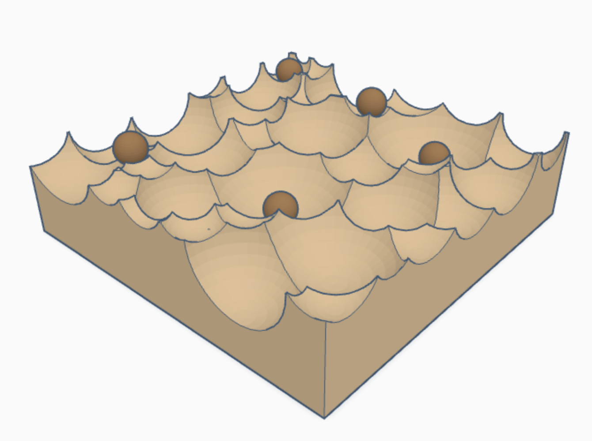
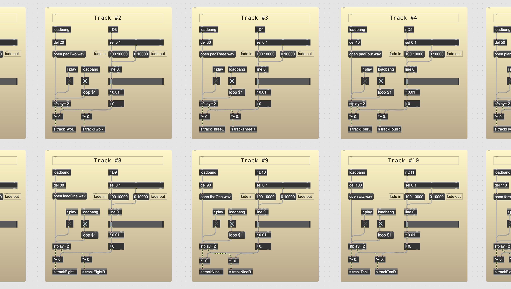

# Stoic Spheres
This artwork consist of a wooden surface with carved contours and six wooden balls. Users interact by moving the balls around, which unmutes different audio tracks. The piece aims to provoke reflection on control and perception, contrasting Stoic principles with modern notions of control. Users' actions influence the auditory experience, emphasizing the role of perception and action in our lives.

The artwork's functionality revolves around user interaction with the wooden balls placed on the carved contours. Beneath 18 of these contours lie light-dependent resistors. When a ball covers a resistor, it triggers the playback of corresponding audio tracks. These tracks consist of synthesized music or environmental recordings, creating an ever-changing auditory landscape. Simultaneously, passages from 'Enchiridion' are played in a random order, ensuring no repetition until all chapters have been heard.

The Arduino board receives values from the resistors, which are then processed by MAX 8. Here, analog inputs are converted to percentages, and digital inputs are temporally verified. This information determines whether a ball is covering a resistor or casting a shadow, adjusting the audio output accordingly. The sound undergoes reverberation before reaching the output, providing a coherent auditory experience.

## User interface

## Input from Arduino

## 18 looping tracks (instruments and soundscapes)

## Random narration from 'Enchiridion' by Epictetus

## Channel volume and panning

